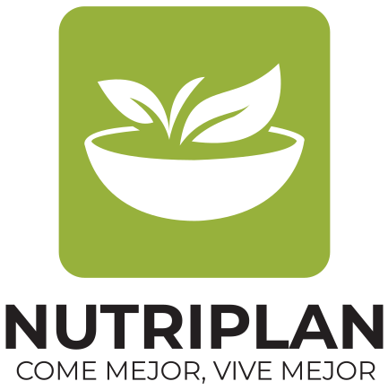

<div align="center">
  
</div>

<div align="right">
  <a>16 de octubre de 2025.</a>
</div>

---

# Documentación

## Resumen Técnico

NutriPlan es la plataforma que personaliza al 100% tu alimentación: recomenda planes y recetas a tu medida según objetivos, condiciones, restricciones de salud, tipo de dieta, tiempo disponible e inventario real de tu cocina. Nuestra diferencia clave es la integración exclusiva de ingredientes y recetas nicaragüenses, respetando sabores y técnicas locales para que comás variado, saludable y accesible con lo que se consigue aquí. Todo en una interfaz simple, con criterios nutricionales claros y ajustes dinámicos según tu avance y feedback. En pocas palabras: personalización total con identidad nica.

---

## Tech Stack

- **Frontend**: SvelteKit y Node.js.
- **Backend**: Django + REST API (Django REST Framework).
- **Base de Datos**: PostgreSQL.

---

## Despliegue

Estamos utilizando la plataforma [`Railway`](https://railway.com) para desplegar todos los componentes de NutriPlan.

- Frontend: [`https://nutri-plan.net`](https://nutri-plan.net)
- Backend: [`https://api.nutri-plan.net`](https://api.nutri-plan.net)

### Backend

Tenemos un ambiente dedicado solamente al backend, donde tenemos un deploy para testing y un deploy de producción. El testing es donde ocurre todo el desarrollo, y cuando las nuevas funcionalidades están listas, se pasan a producción donde el usuario las puede visualizar. Adicionalmente, implementamos pruebas unitarias automatizadas utilizando Github Actions, de tal manera que cada vez que subimos un cambio, las pruebas se ejecutan, y solamente se crea un nuevo deploy si las pruebas fueron exitosas. Esto nos permite mantener un control de calidad sobre lo que exponemos a los usuarios,  y asegurarnos de que cualquier error fatal no sea permanente. En este mismo ambiente, tenemos desplegada nuestra base de datos (PostgreSQL), la cual se respalda automáticamente cada 24 horas.

### Frontend

Adicionalmente tenemos un ambiente para el frontend, donde tenemos la misma separación entre deploys de desarrollo y deploys de producción.

---

## Arquitectura e Infraestructura

### Estructura de Carpetas

```dir
backend/
├─ src/
│   ├─ backend/
│   └─ nutriplan/
│      ├─ admin/
│      ├─ models/
│      ├─ serializers/
│      ├─ services/
│      │  └─ auth/
│      ├─ tests/
│      └─ views/
│         ├─ auth/
│         └─ permissions/
│
└── frontend/
    ├── src/
    │   ├── lib/
    │   │   ├── components/
    │   │   │   ├── forms/
    │   │   │   └── welcome/
    │   │   ├── stores/
    │   │   └── utils/
    │   └── routes/
    │       ├── acerca/
    │       ├── api/
    │       │   ├── login/
    │       │   ├── logout/
    │       │   ├── rate/
    │       │   └── register/
    │       ├── chef-ia/
    │       ├── helloworld/
    │       ├── login/
    │       ├── perfil/
    │       ├── planes/
    │       ├── planificador-ia/
    │       ├── receta-rapida/
    │       ├── recetas/
    │       │   └── [slug]/
    │       └── signup/
    └── static/
        └── styles/
```

### Modelo ORM

Con Django, trabajamos con un modelo ORM, donde las tablas de la base de datos se definen con clases en Python. De ahí, se ocupan como base para crear un API. Los modelos se serializan para poder ser enviados al frontend, y se crean endpoints en los cuales se recibe y envían los datos, listos para ser mostrados (filtrados y ordenados) en el sitio web.

### Microservicios

Los endpoints del API fueron diseñados de manera átomica, independiente y escalabla, de tal manera que cada servicio ofrecido por el API tiene su propia "línea de producción":

> `modelo => serializador => servicio => endpoint`

Adicionalmente, se evitó un diseño monolítico. Al contrario, los elementos del sitio web (backend, frontend, DB) se mantuvieron desacoplados para promover la escalabilidad y evitar conflictos.

---

## Guía de Instalación

Debido a que NutriPlan es un sitio web, no se necesita instalar. Nuestros usuarios solamente necesitan un navegador web para utilizar NutriPlan; pueden acceder desde [https://nutri-plan.net](https://nutri-plan.net) desde cualquier dispositivo o plataforma compatible con un navegador moderno (Chrome, Firefox, Edge, etc.).

## Guía de Ejecución Local

### [Backend](./backend-guia-local.md)

### [Frontend](./frontend-guia-local.md)
